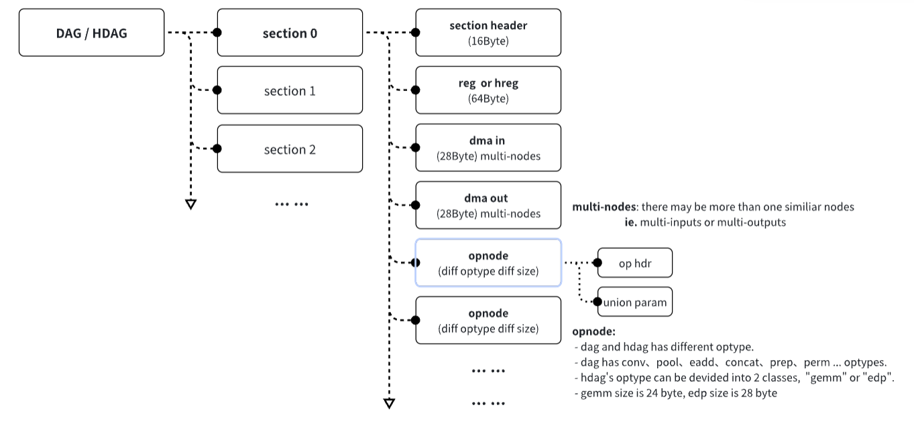
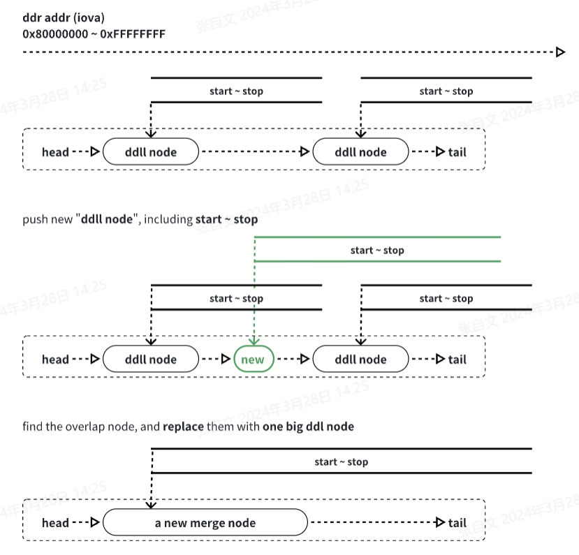

## auto range manger
DDLL means "double direction linked list".
In some times, we expect to mange range feature, which including start address、stop address and size properties.
But，due to the range may be overlaped, but we don't want to make them split, there should be some methods to merge them like water flowing into together.
```
1. Use "DDLL" to manger range area. each node means one range
2. The range of differen nodes shouln't be overlaped
3. If you push one new node into "DDLL", if it has no overlay with any other nodes.Insert it from small to big according to range start address.
4. If you push one new node into "DDLL", but there has overlay with other nodes.
   First, place the new node into "DDLL" from small to big.
   Second, ahead and back search for the head and tail node of the overlay range.
   Finally, repleace the overlap nodes with one new merged node.
```
### section and opnode


## auto range manager/ccode show
``` c
// double direction linked list
typedef struct ddll {
    iova_t iova;
    iova_t stop;
    size_t size;
    struct ddll * ahead;
    struct ddll * next;
    iova_t iova_new;
    void * va_cma;
} s_ddll_t;
s_ddll_t * iova_manager_head = NULL;
s_ddll_t * iova_manager_tail = NULL;

void iova_manager_push(iova_t iova, size_t size, loc_t loc) {
    if (!(iova & 0x80000000)) {
        return; // if iova is smaller than 1G, it's not on ddr address
    }
    DLPRINTF("push: iova 0x%08x, stop 0x%08x, size 0x%08x", iova, (iova+size), size);
    if (iova_manager_head == NULL) {
        iova_manager_head = malloc(sizeof(s_ddll_t));
        if (NULL == iova_manager_head) {
            ELPRINTF();
        }
        iova_manager_head->iova = iova;
        iova_manager_head->size = size;
        iova_manager_head->stop = (iova_t)(iova + size);
        iova_manager_head->ahead = NULL;
        iova_manager_head->next = NULL;
        iova_manager_head->iova_new = 0;
        iova_manager_head->va_cma = NULL;
        iova_manager_tail = iova_manager_head;
        iova_manager_show();
        return;
    }
    s_ddll_t *temp=iova_manager_head;
    s_ddll_t * new_node = malloc(sizeof(s_ddll_t));
    if (NULL == new_node) {
        ELPRINTF();
    }
    new_node->iova = iova;
    new_node->size = size;
    new_node->stop = (iova_t)(iova + size);
    new_node->ahead = NULL;
    new_node->next  = NULL;
    new_node->iova_new = 0;
    new_node->va_cma = NULL;
    s_ddll_t *ahead = NULL;
    s_ddll_t *next  = NULL;
    while (NULL != temp) {
        if (new_node->iova <= temp->iova) {
            ahead = temp->ahead;
            (NULL != ahead) ? (ahead->next = new_node) : NULL;
            new_node->ahead = ahead;
            new_node->next  = temp;
            temp->ahead = new_node;
            break;
        }
        temp = temp->next;
    }
    if (new_node->ahead == NULL && new_node->next != NULL) {
        // has been inserted into ddll
        // take new node into tail
        iova_manager_head = new_node;
        DLPRINTF("insert head");
    }
    if (new_node->next == NULL && new_node->ahead == NULL) {
        // not been inserted into ddll
        // take new node into tail
        iova_manager_tail->next = new_node;
        new_node->ahead = iova_manager_tail;
        new_node->next  = NULL;
        iova_manager_tail = new_node;
        DLPRINTF("insert tail");
    }
    // merge ddll node
    ahead = new_node->ahead;
    next  = new_node->next;
    iova_t start = new_node->iova;
    iova_t stop  = new_node->stop;
    while (ahead != NULL) {
        if (ahead->stop < start) {
            break;
        }
        start = ahead->iova;
        ahead = ahead->ahead;
    }
    while (next != NULL) {
        if (next->iova > stop) {
            break;
        }
        stop = next->stop;
        next = next->next;
    }
    ahead = (ahead != NULL) ? (ahead->next) : (iova_manager_head);
    next  = (next  != NULL) ? (next->ahead) : (iova_manager_tail);
    if (ahead != next) {
        stop  = (stop  >= ahead->stop) ? stop  : ahead->stop;
        // merge into one
        next->stop;
        s_ddll_t *merge_node = malloc(sizeof(s_ddll_t));
        merge_node->iova = start;
        merge_node->stop = stop;
        merge_node->size = stop - start;
        merge_node->ahead = ahead->ahead;
        if (ahead->ahead != NULL) {
            ahead->ahead->next = merge_node;
        }
        merge_node->next  = next->next;
        if (next->next != NULL) {
            next->next->ahead = merge_node;
        }
        merge_node->iova_new = 0;
        merge_node->va_cma = NULL;

        if (ahead == iova_manager_head) {
            iova_manager_head = merge_node;
        }
        if (next == iova_manager_tail) {
            iova_manager_tail = merge_node;
        }

        s_ddll_t *temp0 = ahead;
        s_ddll_t *temp1;
        while (temp0 != next) {
            temp1 = temp0;
            temp0 = temp0->next;
            free(temp1);
        }
    } else {
        DLPRINTF("inplace %p ~ %p, [0x%08x 0x%08x] into [0x%08x 0x%08x] new %p",
                 ahead, next, ahead->iova, next->stop, start, stop, new_node);
    }
    return;
}
```
{: .lineno }

````markdown

```liquid

  This product's title contains the word Pack.

```

````

提示：异或操作是交换的 (𝑎 ⊕ 𝑏 = 𝑏 ⊕ 𝑎)，结合的 ((𝑎 ⊕ 𝑏) ⊕ 𝑐 = 𝑎 ⊕ (𝑏 ⊕
𝑐))，是它自己的逆操作 (𝑎 ⊕ 𝑎 = 0)，并且有一个单位元(𝑎 ⊕ 0 = 𝑎)。
xor x1,x1,x2 # x1’ == x1^x2, x2’ == x2
xor x2,x1,x2 # x1’ == x1^x2, x2’ == x1’^x2 == x1^x2^x2 == x1
xor x1,x1,x2 # x1” == x1’^x2’ == x1^x2^x1 == x1^x1^x2 == x2, x2’ == x1


<!--  -->
<!-- path='commons/pdf/RISC-V-ISA-Chinese.pdf' -->

commons/pdf/RISC-V-ISA-Chinese.pdf


<!--  -->



